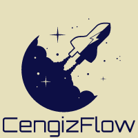
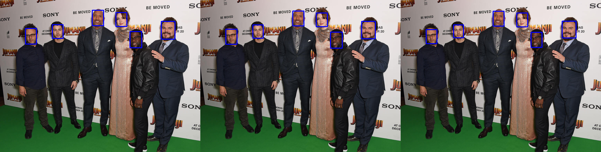

# YOLOv8 Openvino Conversion+Quantization
<p align="center">
  
</p>

## Installation
```
conda create --name yolorepo python==3.8.5
conda activate yolorepo
python -m pip install --upgrade pip
pip install -r requirements.txt -f https://download.pytorch.org/whl/cpu
```
## Inference (Converting & Quantization)
Add the YOLOv8 model you want to convert to the `src/Models` path. Then add the necessary parameters to the terminal command below and run it. 
```
python main.py --modelPath src/Models/best.pt --imagePath src/Assets/testImage.jpg --datasetPath src/datasets/val/images --imageSize 480
```
- **modelPath:** Path of the pretrained yolo model.
- **imagePath:** Path of the image that will be used to compare the outputs.
- **datasetPath:** Path of the dataset that will be used for calibration during quantization.
- **imageSize:** Image size that the model trained.

In the `Output.png` image you can see the results of Torch, Openvino and Quantized Openvino models respectively.

## Test (Quantized Model)
You can try the quantized model in the `test.py` file so that you can try it on a single image.
## My Results
### Speed Test
```
# yolov8n
Vino Mean FPS:           107.43413924442955
Quantized Vino Mean FPS: 258.2177983756975
```
### Size Test
```
# yolov8n
Openvino size: 12.1 MB
Quantized size: 3.1 MB
```
### Image Test

<p align="center">
  
</p>